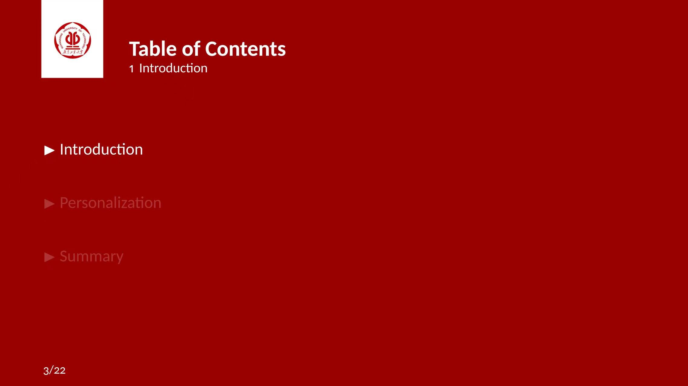
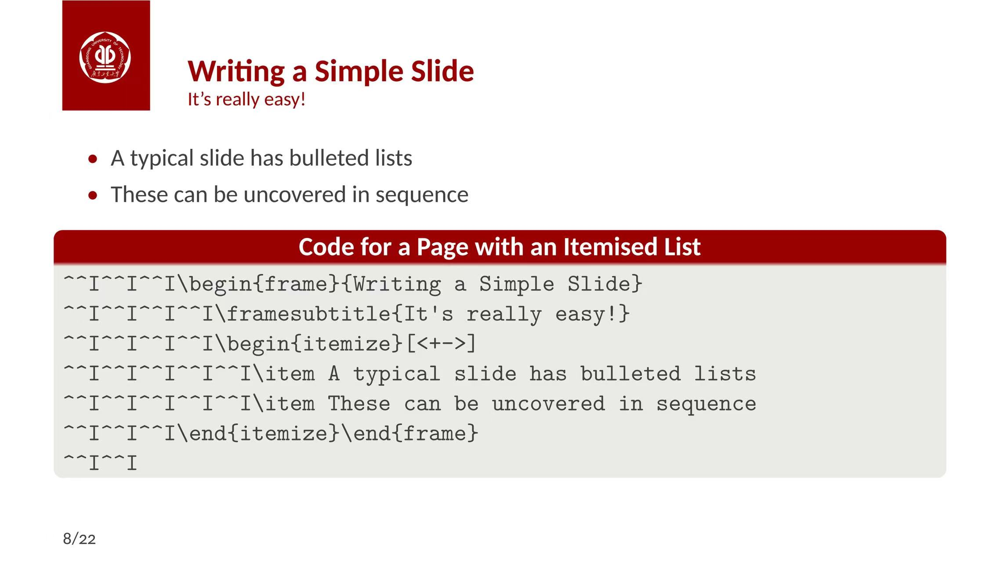

# GDUT-Beamer-Template
广东工业大学 PPT 模板，根据北大模版改编

前两天用这个模板答辩拿到国奖了

如果会 Latex 且注重页面简洁

推荐你使用这个模板

任何使用困难

联系：jiahaoli57@163.com

Overleaf 链接：[Overleaf](https://www.overleaf.com/latex/templates/yan-dong-gong-ye-da-xue-zhong-wen-mo-ban-gdut-beamer-template/gyrbwbthpvcn)
 
# 例子

